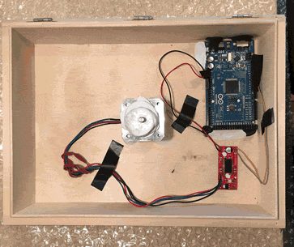

# Illustrated Set Up Guide

## Unpacking the motorised sculpture

The black disc should be mounted carefully and set level with respect to the box.

## Plugging into the motorised sculpture

The grey cable connects the Arduino to the controlling laptop.

The black power lead provides the AC power needed for the stepper motor via the Arduino.

The power adapter expects a mains voltage of ~230V. In countries such as Japan or the USA where the mains voltage is lower, a transformer may be required.

Once the sculpture has been plugged in, you should see LEDs light up on the Arduino and EasyDriver inside the box.

## Packing up the motorised sculpture

